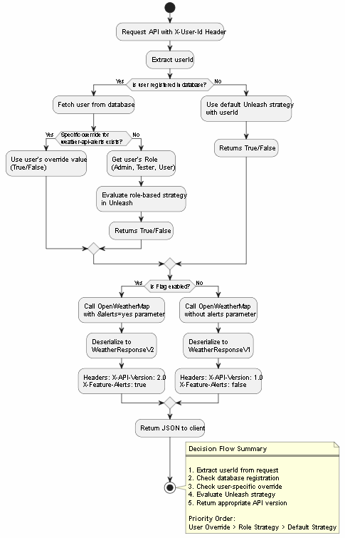

# Feature Flags with Unleash

From Risky Deployments to Controlled Rollouts

## The Challenge We Faced

Picture this: You need to replace a legacy feature of your product. In our cenario, it's going to be an API endpoint living in a monorepo, used by multiple users.

### 🌐 **pt-br**:

```markdown
- Desafio: Implantação tradicional significa que qualquer bug impacta instantaneamente 100% dos usuários, e rollbacks exigem reimplantação completa do sistema.
- Ação: Sistema de feature flags usando Unleash.
- Resultado: tempo de rollback reduzido de minutos para segundos, aumento na frequência de implantações
```

**The risks were real:**

- ❌ One bug affects 100% of users immediately
- ❌ Rollback means full deployment revert
- ❌ No way to test with real production traffic
- ❌ Canary releases? Manual and painful

Traditional approach? Create a long-lived branch, merge weeks later, and pray. We've all been there.

## The Alternative: Feature Flags + Trunk-Based Development

By combining **Unleash** (open-source feature flag platform) with **Git** (trunk-based development), we transformed our deployment process:

### Before:

Develop → Merge → Deploy → 🤞 → Incident → 😭 → Rollback (30+ min)

### After:

Develop → Merge (behind flag) → Deploy → Toggle flag (1 sec) → Monitor → 🤝

**The magic happens because:**

- **Code and release are decoupled** - Merge today, release next week
- **Kill switch built-in** - Disable bad feature instantly without redeploy
- **Production testing safe** - Enable for 1% → 10% → 100%
- **User-specific rollouts** - VIPs see V2, regular users see V1

## Real Implementation: Weather API Case Study

Here's how we implemented this pattern in a .NET Core Web API that consumes OpenWeatherMap:

### 1. The Scenario

- **Version 1**: Return `{ lat, lon, timezone, current }`
- **Version 2**: Add `alerts` array to response
- **Requirement**: Roll out safely, user by user

### 2. Project Configuration

```csharp
// Program.cs - Add Unleash
builder.Services.AddSingleton<IUnleash>(sp => new DefaultUnleash(
    new UnleashSettings
    {
        AppName = "weather-api",
        UnleashApiUrl = "http://localhost:4242/api"
    }
));

// WeatherService.cs - Use flag
public async Task<object> GetWeatherAsync(string userId, double lat, double lon)
{
    var context = new UnleashContext().SetUserId(userId);
    var enableAlerts = _unleash.IsEnabled("weather-api-alerts", context);

    var url = enableAlerts
        ? $"onecall?lat={lat}&lon={lon}&alerts=yes"
        : $"onecall?lat={lat}&lon={lon}";

    var response = await _client.GetAsync(url);

    return enableAlerts
        ? JsonSerializer.Deserialize<WeatherResponseV2>(response)
        : JsonSerializer.Deserialize<WeatherResponseV1>(response);
}
```

### 3. User-Specific Control (Advanced)

We extended this to support per-user overrides:

// Decision flow priority:
// 1. User-specific override (database)
// 2. Role-based strategy (Unleash)
// 3. Default rollout strategy (Unleash)

```csharp
public async Task<bool> IsFeatureEnabledForUser(string userId, string flag)
{
    var user = await _db.Users.FindAsync(userId);

    // User-specific override wins
    if (user?.FeatureFlags.ContainsKey(flag) == true)
        return user.FeatureFlags[flag];

    // Fallback to Unleash strategies
    return _unleash.IsEnabled(flag, new UnleashContext()
        .SetUserId(userId)
        .AddProperty("role", user?.Role ?? "anonymous"));
}
```

### 4. The Decision Flow



| Key Metrics After Implementation |                                 |
| -------------------------------- | ------------------------------- |
| Rollback time                    | From 30 minutes → 5 seconds     |
| Production incidents             | ↓ 85% (related to new features) |
| Deployment frequency             | ↑ 3x (no fear anymore)          |
| User impact                      | Limited to controlled groups    |

## The Bottom Line

Feature flags aren't just about toggling features. They're about shifting left on risk - moving production concerns from "after deployment panic" to "before merge confidence". With Unleash + Git + trunk-based development, you can:

- Deploy anytime, release when ready
- Test in production safely
- Respond to incidents instantly
- Give VIPs early access

| Practice                | Why It Matters                                       |
| ----------------------- | ---------------------------------------------------- |
| Trunk-based development | No merge hell. All changes go to main behind flags   |
| Unleash for control     | Centralized dashboard, real-time toggles, audit logs |
| User-specific overrides | Test with real users before broad rollout            |
| Gradual rollout         | 1% → 10% → 50% → 100%. Sleep well each night         |
| Start small             | Flag one simple feature first                        |
| Clean up old flags      | Archive them after 100% rollout                      |
| Monitor everything      | Track flag evaluation metrics                        |
| Document your flags     | What they do, who owns them                          |
| Test both paths         | Code must work with flag ON and OFF                  |

## Resources to Get Started

```csharp
# Start Docker Desktop, then run:
docker compose up --build -d

#Ports:
#FeatureFlag.Web: http://localhost:5087
#FeatureFlag.API: http://localhost:5086/scalar
#Unleash: http://localhost:4242
```

## Running with Docker secrets (EBird API key)

This repository supports providing the EBird API key to the `featureflag-api` service via Docker secrets. Steps:

- Add your key in `secrets/ebird_api_key.txt` on the first line. Do NOT commit this file.
- Start services with compose: `docker compose up --build -d`.

The compose file maps the secret into the API container at `/run/secrets/ebird_api_key`. The application will read the key from that file if `EBird:ApiKey` is not set in `appsettings.json` or environment variables.

Alternative local options:

- Use `dotnet user-secrets` in `FeatureFlag.API`:

```bash
cd FeatureFlag.API
dotnet user-secrets init
dotnet user-secrets set "EBird:ApiKey" "<your-key>"
```

- Or set an environment variable for local Docker runs: `EBIRD__APIKEY_FILE` pointing to a file containing the key, or `EBird__ApiKey` as a direct env var.

## Links

[Weatherstack API](https://docs.apilayer.com/weatherstack/docs/api-documentation?utm_source=WeatherstackHomePage&utm_medium=Referral)
